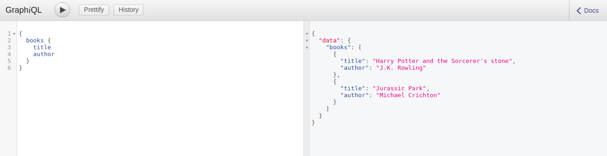
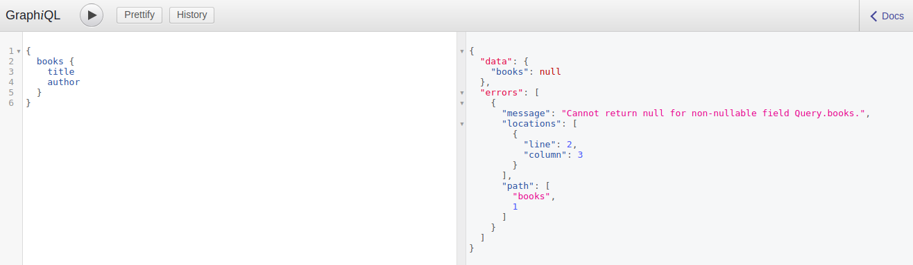

# Setup

## Mục tiêu

* Tạo GraphQL server với [apollo-server](https://www.apollographql.com/docs/apollo-server/)
* Hiểu được cách tương tác với GraphQL thông qua `Query`

## Khởi tạo project

* Tạo thư mục và khởi tạo project bằng `yarn` (các bạn đã biết cách làm thông qua project trước)
* Cài đặt `express` và các module liên quan `$ yarn add express body-parser compression errorhandler morgan lodash dotenv`
* `body-parser` Convert body từ string sang json
* `compression` Express middleware để nén dữ liệu
* `errorhandler` Expres middleware để hiển thị lỗi với đầy đủ chi tiết trong môi trường `development`
* `morgan` Hiển thị `http request` trên console trong môi trường `development`
* Tạo file `.env` để sử dụng biến môi trường

```text
# Sytstem
NODE_ENV=development
MONGO_URI=mongodb://mongo/job

# API
API_ENDPOINT=/graphql
API_PORT=9999
```

## Setup app

Đầu tiên các bạn cần tạo file `src/app.js` với nội dung

```javascript
const express = require('express');
const bodyParser = require('body-parser');
const { graphqlExpress, graphiqlExpress } = require('apollo-server-express');
const { makeExecutableSchema } = require('graphql-tools');

// Some fake data
const books = [
  {
    title: "Harry Potter and the Sorcerer's stone",
    author: 'J.K. Rowling',
  },
  {
    title: 'Jurassic Park',
    author: 'Michael Crichton',
  },
];

// The GraphQL schema in string form
const typeDefs = `
  type Query { books: [Book] }
  type Book { title: String, author: String }
`;

// The resolvers
const resolvers = {
  Query: { books: async () => books },
};

// Put together a schema
const schema = makeExecutableSchema({
  typeDefs,
  resolvers,
});

// Initialize the app
const app = express();
const
// The GraphQL endpoint
app.use('/graphql', bodyParser.json(), graphqlExpress({ schema }));

// GraphiQL, a visual editor for queries
app.use('/graphiql', graphiqlExpress({ endpointURL: '/graphql' }));

// Start the server
app.listen(3000, () => {
  console.log('Go to http://localhost:3000/graphiql to run queries!');
});
```

Trong đó chúng ta khai báo hai `express middleware` để sử dụng GraphQL là

* `app.use("/graphql", ...)` đường dẫn đăng ký `graphqlExpress`
* `app.use("/graphiql", ...)` Trong quá trình phát triển sản phầm ban đầu, các bạn sẽ cần một nơi để test các GraphQL query. Nên đây sẽ là giao diện web để các bạn sử dụng

Ở project này, mình sử dụng `apollo-server` để thực hiện việc cài đặt GraphQL nên các bạn sẽ thấy có các hàm sau

* `graphqlExpress` dùng để khai báo các setting cho ứng dụng GraphQL. Hiện tại các bạn chỉ cần chú ý đến biến `schema` - là nơi để khai báo các câu query của GraphQL
* `graphiqlExpress` dùng để cài đặt một editor để test GraphQL trên giao diện web

Ok giờ là lúc bạn test thử sản phẩm ban đầu (Dành cho bạn nào quên `$ node src/app.js`). Bạn vào [http://localhost:3000/graphiql](http://localhost:3000/graphiql) và thực hiện câu query,
sau đó chạy câu query (click button play bên phải logo GraphiQL) thì sẽ được kết quả



## GraphQL

### typeDefs

Khi tương tác với GraphQL, các bạn cần phải **định nghĩa** cách client muốn lấy dữ liệu (`query` và `mutation`) và cách server sẽ trả về dữ liệu dựa trên truy vấn của client (`resolvers`)ả

Trong một ứng dụng sử dụng REST, chúng ta thường sẽ có hai dạng endpoint - lấy dữ liệu (`GET`) và cập nhật dữ liệu (`POST`, `PUT`, `DELETE`), thì ở GraphQL chúng ta cũng có hai dạng endpoint tương ứng là `Query` và `Mutation`.

Bất kể Query`hay`Mutation`thì khi định nghĩa chúng, chúng ta phải khai báo kiểu dữ liệu mà chúng sẽ nhận - tương tự như cách mà các`Statically typed languages`địng nghĩa như Java, C, C++. Ví dụ bạn muốn lấy các`Book`từ server, mỗi`Book`bạn muốn lấy`title`và`author`. Cả hai field`title`và`author`bạn chỉ muốn nhận về là`String`mà không phải là`undefined`,`null`hay`object`, ... Để làm được việc đó, bạn phải định nghĩa ở server để Book chỉ nhận về kiểu`String`cho hai field trên. Thế là`type` ra đời - [scalar-types](http://graphql.org/learn/schema/#scalar-types)

```
...

type Book { title: String, author: String }

...
```

Trong GraphQL, chúng ta có các `scalar types` - là những kiểu dữ liệu được định nghĩa sẵn trong GraphQL. ngoài `String` thì chúng ta còn có `Int`, `Float`, `Boolean`, `ID`.

Thật chất khi mình gọi `Query` và `Mutation` là endpoint chỉ để các bạn dễ liên tưỏng đến REST. Chúng cũng là hai `type`, nhưng là hai `type` đặc biệt của GraphQL. Với `Query`, bạn sẽ định nghĩa những dữ liệu nào mà bạn muốn client có thể lấy được từ ứng dụng của chúng ta

```
...

type Query { books: [Book] }

...
```

Ở đây, chúng ta muốn client có thể lấy về `books` là một array của các `Book`. Và như demo ở trên, các bạn sẽ lấy được hai `Book`. Vậy điều gì sẽ xảy ra khi chúng ta trả về hai `Book` nhưng một trong số chúng là `undefined`, là `null` mà không phải một `Book`? Câu trả lời là `Không gì cả`

Các bạn sửa lại đoạn code sau

```javascript
...

// Some fake data
const books = [
  {
    title: "Harry Potter and the Sorcerer's stone",
    author: 'J.K. Rowling',
  },
  null
];

....
```

Ở đây, chúng ta muốn client có thể lấy về `books` là một array của các `Book`. Và như demo ở trên, các bạn sẽ lấy được hai `Book`. Vậy điều gì sẽ xảy ra khi chúng ta trả về hai `Book` nhưng một trong số chúng là `undefined`, là `null`, là `false` mà không phải một `Book`? Câu trả lời là `Không gì cả`

Các bạn sửa lại đoạn code sau

```javascript
...

// Some fake data
const books = [
  {
    title: "Harry Potter and the Sorcerer's stone",
    author: 'J.K. Rowling',
  },
  null
];

....
```

Có vẻ sai sai ở đây, vì chúng ta muốn kết quả trả về là array của `Book`??? Đó là vì bạn cho phép server sẽ trả về kết quả không phải là `instance` của `Book`, mà có thể trả về `null`. Để thực hiện việc ràng buộc, chúng ta thêm dấu `!` ngay phía sau `Book`, như thế này

```
...

type Query { books: [Book!] }

...
```

Và rồi khi bạn chạy lại câu query thì sẽ có lỗi như sau



Tương tự như vậy, bạn cùng có thể bắt buộc `Book` luôn luôn trả về dữ liệu mà không phải là `null`

```
...

type Book { title: String!, author: String! }

...
```

Hiểu một cách đơn giản thì dấu `!` cũng tương với một `required validation` trong `SQL`, nó sẽ không chấp nhận kết quả trả về là `null`, là `undefined`, là `false`.

#### resolvers

Sau khi định nghĩa cách mà client sẽ lấy dữ liệu thông qua `Query` thì chúng ta cần phải **giải quyết** cách mà server sẽ trả dữ liệu khi client thực hiện việc query. Thế là `resolvers` ra đời :D

Bắt buộc bạn phải có một `resolver` tương ứng với `Query` và `Mutation` mà bạn khai báo trong `typeDefs`. Ở đây chúng ta cần phải **giải quyết** `books`

```
...

Query: { books: async () => books },

...
```

Resolver sẽ nhận kết quả trở về là một `Promise`. Ở đây khi client query `books` chúng ta sẽ trả về kết quả - có thể từ bất cứ đâu mà bạn muốn, từ database ở local hay ở remote server, hoặc từ một api khác, ...
