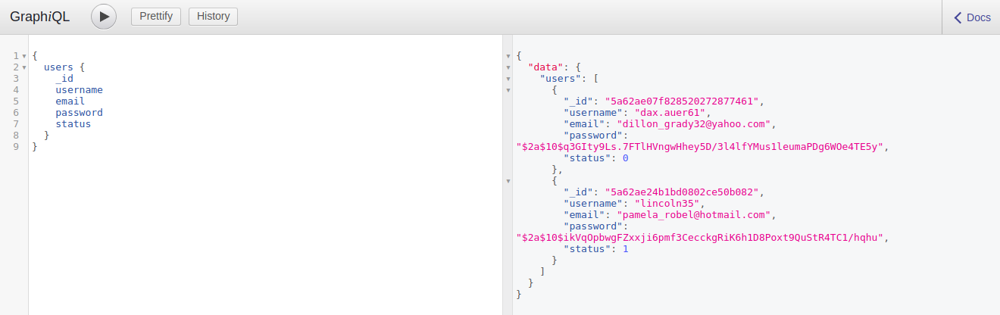
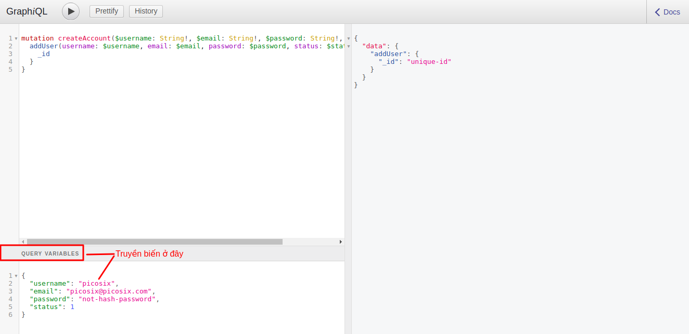
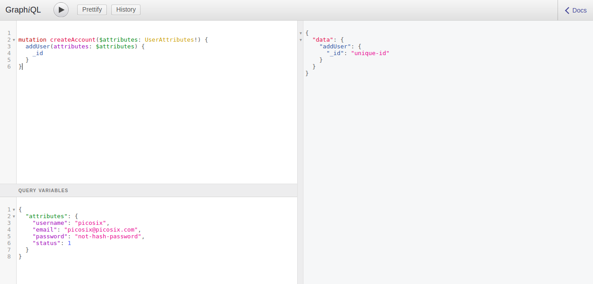

# Mutation

## Mục tiêu

* Giới thiệu cách khai báo kiểu dữ liệu trong GraphQL (`type` và `input`)
* Giới thiệu các khai báo `Mutation`
* Sử dụng `Mutation` với Apollo Server

## Khai báo `type User`

Như ở bài trước mình đã giới thiệu, để có thể truy vấn dữ liệu với GraphQL thì chúng ta cần phải khai báo `Query`. Tương ứng với việc tạo mới, cập nhật và xoá dữ liệu thì chúng ta có `Mutation`. Trong bài này, mình sẽ sử dụng ví dụ với data của một `User`

## Khai báo `type User`

Các bạn còn nhớ đoạn khai báo biến `typeDefs` ở bài trước? Chúng ta cần sửa lại như sau

```javascript
...

const typeDefs = `
  type Query { users: [User!] }
  type User {
    _id: ID!
    username: String!
    email: String!
    password: String!
    status: Int!
   }
`;

...
```

Như các bạn thấy thì mình thêm `type User` vào `Query` và định nghĩa `type User` ngay bên dưới với các field cần thiết. Lúc này, các bạn cần sửa lại đoạn code khai báo biến `resolvers` như sau

```javascript
...

const users = [
  {
    _id: "5a62ae07f828520272877461",
    username: "dax.auer61",
    email: "dillon_grady32@yahoo.com",
    password: "$2a$10$q3GIty9Ls.7FTlHVngwHhey5D/3l4lfYMus1leumaPDg6WOe4TE5y",
    status: 0
  },
  {
    _id: "5a62ae24b1bd0802ce50b082",
    username: "lincoln35",
    email: "pamela_robel@hotmail.com",
    password: "$2a$10$ikVqOpbwgFZxxji6pmf3CecckgRiK6h1D8Poxt9QuStR4TC1/hqhu",
    status: 1
  }
];

...

const resolvers = {
  Query: { users: async () => users }
};

...
```

Giờ thì bạn có thể test lại với câu query như sau



## Khai báo Mutation

Để khai báo `Mutation`, bạn cần sửa thêm `type Mutation` vào biến `typeDefs` như sau

```javascript
...

const typeDefs = `
  type Query { users: [User!] }
  type Mutation {
    addUser(
      username: String!
      email: String!
      password: String!
      status: Int!
    ): User!
  }
  type User {
    _id: ID!
    username: String!
    email: String!
    password: String!
    status: Int!
   }
`;

...
```

Ở đây mình khái báo `Mutation` `addUser` với các tham số `username`, `email`, `password`, `status` và bắt buộc `Mutation` này phải trả về dữ liệu với format của `type User` (đoạn `: User!`).

Các bạn luôn phải nhớ rằng khi bạn thêm một function vào `Query` và `Mutation` thì bạn cũng phải khai báo `resolver` tương ứng cho function đó. Việc tiếp theo là mình sẽ khai báo một resolver cho hàm `addUser` mà mình vừa khai báo

```javascript
...

const resolvers = {
  Query: { users: async () => users },
  Mutation: {
    async addUser(
      obj = {},
      { username = "", email = "", password = "", status = 0 },
      context = {},
      info = {}
    ) {
      return {
        _id: "unique-id",
        username,
        email,
        password,
        status
      };
    }
  }
};

...
```

Ở đây, hàm `addUser` nhận vào **4** tham số, lần lượt là

* `obj` là `object` chứa kết quả trả về của các `resolver` ở các field cha. Hiện tại thì bạn chưa cần quan tâm đến tham số này.
* `args` là object chứa các `arguments` mà bạn truyền vào ở câu query `Mutation`. Ví dụ bạn truyền vào hàm `author(name: "picosix")` thì `args` sẽ là `{ "name": "Ada" }`
* `context` là object chứa các state trên mỗi request, tương tự như cách hoạt động của biến `req` trên `express`
* `info` là object chứa các thông của câu query đang được thực hiện

Để phục vụ cho việc demo, mình sẽ không tiến hành thao tác với database ở bài này. Mình chỉ đơn giản là trả về cấu trúc dữ liệu tương ứng với `type User` mà mình đã khai báo ở bài trên.

Với `type Query` bạn có thể viết có hoặc không có tiền tố `query`. Ví dụ hai kiểu query sau đều được chấp nhận

```
query {
  users {
    _id
    username
    email
    password
    status
  }
}
```

hoặc

```
{
  users {
    _id
    username
    email
    password
    status
  }
}
```

Nhưng với kiểu `Mutation` thì bạn bắt buộc phải có tiền tố `mutation`. Đồng thời các khai báo của câu `Mutation` cũng có chút khác biệt như sau

```
mutation createAccount($username: String!, $emai: String!, $password: String!, $status: Int!) {
  addUser(username: $username, email: $email, password: $password, status: $status) {
    _id
  }
}
```

Trong đó các bạn có thể thấy hàm `addUser` của chúng ta được bao lại bằng hàm `createAccount`. Lý do là bạn phải viết như thế thì mới có thể truyền các biến vào câu query. Sau khi thực hiện việc tạo user thì chúng ta sẽ yêu cầu server trả về `_id` của document vừa được tạo ngay lập tức mà không cần phải thực hiện một câu query khác.

**Note** Một điều quan trọng mà các bạn cần nhớ là nếu bạn khai báo `type User` với `username: String!` thì biến `$username` với static type `String` cũng phải có dấu `!` ở cuối.

Tiếp theo các bạn có thể test bằng câu query như sau



Lưu ý là khung `QUERIES VARIABLES` nằm sát góc dưới bên trái, các bạn có thể kéo nó lên để truyền vào các biến của bạn

## Khai báo `input UserAttributes`

Ở phần trên, nếu muốn tạo user, các bạn cần phải truyền 4 biến vào cho hàm `addUser`, vậy nếu chúng ta có nhiều biến hơn thì sao? Và nếu bạn có thêm một hàm nữa cũng nhận tham số giống như vậy? Đó là lúc chúng ta sử dụng một kiểu data của GraphQL để có thể khai báo input đầu vào và tái sử dụng ở các hànm khác khau - đó là `input`.

Khai báo `input` cũng tương tự như cách mà bạn khai báo `type`

```javascript
...


const typeDefs = `
  type Query { users: [User!] }
  addUser(attributes: UserAttributes!): User!
  input UserAttributes {
    username: String!
    email: String!
    password: String!
    status: Int!
  }
  type User {
    _id: ID!
    username: String!
    email: String!
    password: String!
    status: Int!
  }
`;

...
```

và sửa phần `resolver` để nhận duy nhất tham sô `attributes` thay vì 4 như trước

```javascript
...

const resolvers = {
  Query: { users: async () => users },
  Mutation: {
    async addUser(obj = {}, { attributes = {} }, context = {}, info = {}) {
      return Object.assign({ _id: "unique-id" }, attributes);
    }
  }
};

...
```

Sau đó thì các bạn có thể test lại bằng câu query bên dưới



## Bài tập

Vậy là mình đã giới thiệu xong phần `Query` và `Mutation` cho các bạn. Hiện tại, việc các bạn cần làm là phải lưu data khi sử dụng hàm `addUser` vào database - mongo thay vì trả về dữ liệu giả.

Ở bài sau mình sẽ tiến hành tái cấu trúc project để dễ dàng cập nhật các tính năng mới.
